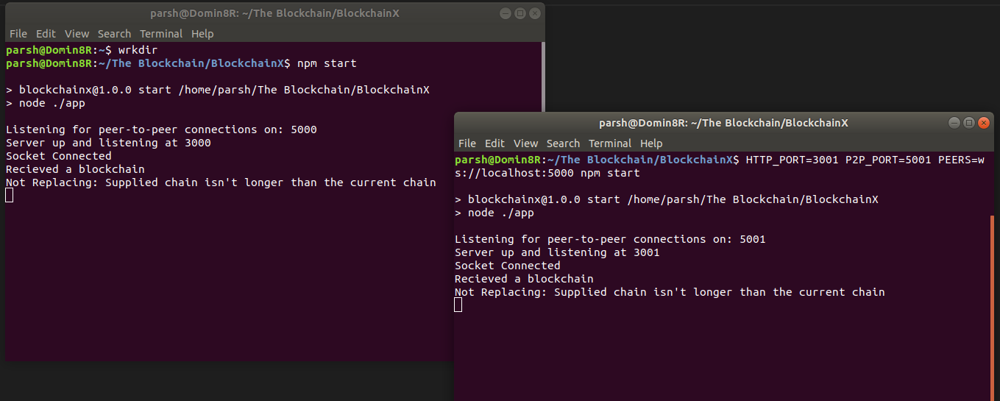

# BlockchainX

BlockchainX is a full-fledged blockchain application. Specifically, it's a peer-to-peer electronic cash system, inspired by Bitcoin, with CoinX as it's cryptocurrency. 

## Getting Started

These instructions will get you a copy of the project up and running on your local machine for development and testing purposes. 

### Prerequisites

BlockchainX is built upon the Node.js javascript runtime. Therefore, you'll need [Node](https://nodejs.org/en/) version 8.0 or above in order successfully construct the project.  


### Installing

Start by cloning the repository to your machine.

```
$ git clone https://github.com/Parsh24/BlockchainX.git
```

Move into the cloned directory and perform npm install in order to install the dependencies (which will appear in the node_modules folder).

```
$ cd BlockchainX
$ npm install
```

Once the dependency installation completes, type in `npm start` and if you see the following output that implies that BlockchainX is successfully built.

```
$ npm start
$ > blockchainx@1.0.0 start /home/../BlockchainX
$ > node ./app

$ Listening for peer-to-peer connections on: 5000
$ Server up and listening at 3000

```

## Running the tests

Let's have a look at how to run the automated tests for this system in order to be certain that the BlockchainX system is properly integrated and that nothing is broken.

### Prerequisites

The tests for BlockchainX are written using Jest, therefore, you have to install [jest](https://www.npmjs.com/package/jest) using the following command: 

```
$ npm install jest --save-dev
```

### Tests in action

There are 31 unit tests packed into 5 test suites that assits in ensuring that every dynamic component of the project is working as intended. Run the following command to execute the tests:

```
$ npm test
```

If you see the following output after the tests complete, it implies that no component of BlockchainX is broken and we are all good to get the project up and running.

```
Test Suites: 5 passed, 5 total
Tests:       31 passed, 31 total
Snapshots:   0 total
Time:        7.412s, estimated 10s
Ran all test suites.
```

## Establishing a P2P-Network

In order to perform actions like creating transactions, mining blocks etc., you would first need to setup a network of peers (which should contain a minimum of 2 peers). In order to do so, open the command-prompt/terminal, make your way into the BlockchainX directory and type in the following command.

```
$ npm start
```

The above command would spawn a P2P-server, which acts as a Node in the BlockchainX system, listening on the defualt ports (HTTP_PORT = 3000, P2P_PORT = 5000). 

Now, in order to spawn another instance of the P2P-server, open a new instance of terminal and get into the BlockchainX directory. Now, we'll need to speicfy the ports (as the defaults are used by the 1st instance) as well as the peers to this instance. You could use the following command to do that.

```
$ HTTP_PORT=3001 P2P_PORT=5001 PEERS=ws://localhost:5000 npm start
```

It should produce an output as shown in the image below.



If everything went well to this point, then you have a small (2 instances) P2P-network operating successfully. In order to expand the network, you can use the following commnand-template to sprout new P2P-servers:

```
HTTP_PORT=<specify_http_port> P2P_PORT=<specify_p2p_port> PEERS=<specify_peers_seperated_by_commas> npm start
```

For example, in order to spawn a 3rd instance, you can use:  
```
HTTP_PORT=3002 P2P_PORT=5002 PEERS=ws://localhost:5000,ws://localhost:5001 npm start
```

And that completes the establishment of the P2P-Network.

## Operating the system

### Using Wallet

Each P2P-server instance(node) comes with an in-built wallet which could be used create, sign and send transactions as well as it exposes the publicKey, which acts as an address, to recieve payments. In order to get the economy going, each wallet starts with an initial balance (as specified in config.js).

Following are the API endpoints, as specified in app/index.js, that you can use to interact (using Postman for example) with the system:

GET Requests:

- http://localhost:<http_port>/check-balance : provides json specifying wallet's current balance.

- http://localhost:<http_port>/public-key    : provides json specifying wallet's public key which acts as an address in the system.

POST Request:

- http://localhost:<http_port>/transact      : constructs a transaction and broadcasts it into the network. The post request requires the sender to specify the address of the recipient and the amount to be sent.  

### Mining Blocks

Every P2P-server is also loaded with mining capabilities, therefore, they can mine blocks using the Proof of Work (Hashcash) mechanism and in that process they grab valid transactions(unconfirmed) from the transaction pool and add them to the blockchain, thereby, confirming the transactions. The rate at which a block is mined, is specified in config.js and it also keeps the dynamic difficulty in check. 

Following are the API endpoints:

GET Requests:

- http://localhost:<http_port>/blockchain       : provides the blockchain (current state) in json format.

- http://localhost:<http_port>/transaction-pool : provides the transactions that are currently present in the transaction pool.

- http://localhost:<http_port>/mine-block             : instructs the node to start mining a block.

At the moment, there is no transaction fee, however, to incentivise miners to mine the blocks and confirm transactions a reward of 50 CoinX is provided, in the form of a coinbase transaction, to the miner who successfully mines the block.